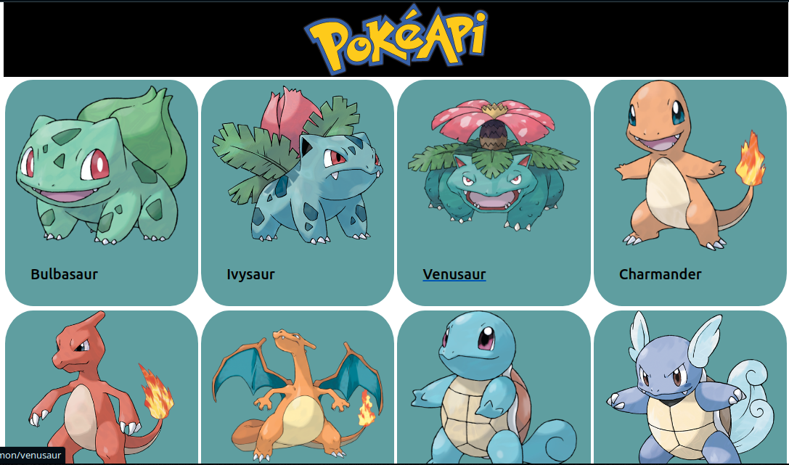
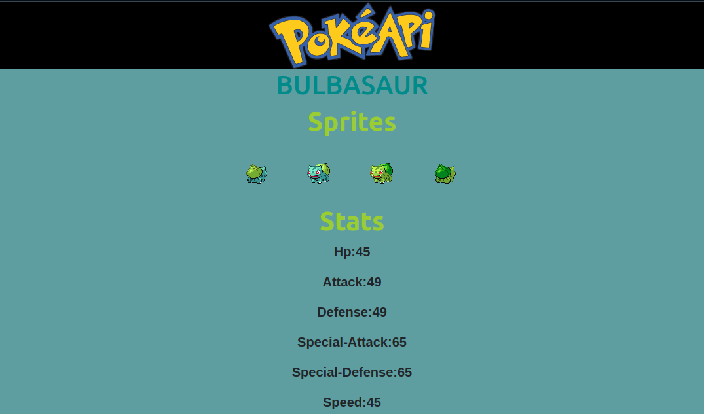

<h1 align="center">
  Pokemon Catalogue.
</h1>

<strong>Pokemon App</strong> retrieves data from <strong>The Pokemon</strong> API. You can get to view a list of pokemons and also view the full details of each pokemon by clicking on the pokemon image. It is built using <strong>React</strong> and utilizes <strong>Redux</strong> state management.

**Home Page**

  

**Single Pokemon Page**

  

## live demo
[Pokemon view](https://somoye-meology.netlify.app)

## Features
- A list of Pokemons from the official Api.
- When the image of a single item in the list is clicked, the full details will be displayed.
- You can navigate back to the home page.

### Production Dependencies

| **Dependency**   | **Use**                                              |
| ---------------- | ---------------------------------------------------- |
| axios       | Promise based HTTP client for the browser and node.js |
| enzyme       | JavaScript Testing utility for React and its components |
| lodash       | provides utility functions for simplifying the handling and edition of objects, arrangements, etc |
| prop-types       | Declare types for props passed into React components |
| react            | React library                                        |
| react-dom        | React library for DOM rendering                      |
| react-redux      | Connects React components to Redux                   |
| react-router-dom | React library for routing                            |
| redux            | Library for unidirectional data flows                |
| redux-thunk      | Async redux library                                  |

### Development Dependencies

| **Dependency**                  | **Use**                                                          |
| ------------------------------- | ---------------------------------------------------------------- |
| babel-eslint                    | Lint modern JavaScript via ESLint                                |
| eslint                          | Lints JavaScript                                                 |
| eslint-plugin-react-hooks       | Adds additional React-hooks-related rules to ESLint              |
| eslint-plugin-import            | Advanced linting of ES6 imports                                  |
| eslint-plugin-react             | Adds additional React-related rules to ESLint                    |
| axios-fetch-mock                      | Mock fetch calls                                                 |
| jest                            | Automated testing framework                                      |
| node-fetch                      | Make HTTP calls via fetch using Node - Used by fetch-mock        |
| react-test-renderer             | Render React components for testing                              |
| @testing-library                | Test React components                                            |
| redux-immutable-state-invariant | Warn when Redux state is mutated                                 |
| redux-mock-store                | Mock Redux store for testing                                     |
| stylelint                       | Lints Css                                                        |
| stylelint-config-standard       | Advanced linting configoration for css                           |
| stylelint-csstree-validator     | Advanced linting validation for css                              |
| stylelint-scss                  | Adds additional SCSS-related rules to StyleLint                  |

### Prerequisites

- Node
- Npm

### Setup

- git clone `git@github.com:tzvaita/react-redux-api-spa.git`
- cd react-redux-api-spa
- npm install
- npm start
- **Install [React developer tools](https://chrome.google.com/webstore/detail/react-developer-tools/fmkadmapgofadopljbjfkapdkoienihi?hl=en) and [Redux Dev Tools](https://chrome.google.com/webstore/detail/redux-devtools/lmhkpmbekcpmknklioeibfkpmmfibljd?hl=en)** in Chrome.

## Author

👤 **Tennyson Takudzwa Zvaita**

- Github: [@tzvaita](https://github.com/tzvaita)
- Twitter: [@tennyzvaita](https://twitter.com/tennyzvaita)
- LinkedIn: [tennyzvaita](https://www.linkedin.com/in/tennyzvaita)
- Mail: [tzvaita@gmail.com](tzvaita@gmail.com)

## 🤝 Contributing

Contributions, issues and feature requests are welcome!

Feel free to check the [issues page](https://github.com/tzvaita/react-redux-api-spa/issues).

## Show your support

Give a ⭐️ if you like this project!

## Acknowledgments
  - [Microverse](https://www.microverse.org/)
  - You can access all the design info (color, typography, layouts) in this link:
  - [Design](https://www.behance.net/gallery/31579789/Ballhead-App-(Free-PSDs))
  - Design idea by [Nelson Sakwa on Behance](https://www.behance.net/sakwadesignstudio)
  - [Pokeapi](https://pokeapi.co/?)
  - [Bootstrap](https://getbootstrap.com/)